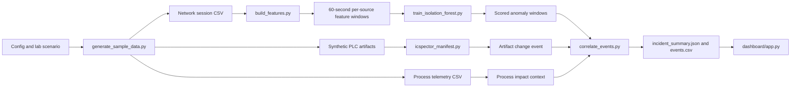

# OT Sentinel Lite

[](https://github.com/Jayandra10/ot-sentinel-lite/actions/workflows/ci.yml)
[](https://github.com/Jayandra10/ot-sentinel-lite/releases)
[](LICENSE)
[](requirements.txt)
[](https://github.com/Jayandra10/ot-sentinel-lite/commits/main)

OT Sentinel Lite is a small, lab-only OT/ICS portfolio project that correlates:

- Malcolm/Zeek-style PLC network-session evidence,
- a normal-only Isolation Forest anomaly score,
- a deterministic hash comparison of ICSpector-exported PLC artifacts, and
- an explainable evidence-fusion risk score shown in a visual-first Streamlit dashboard.

The repository starts with synthetic evidence so the complete software path can be verified before a Raspberry Pi, CODESYS PLC, packet capture, Malcolm, or ICSpector is introduced. The Pi is a later integration target, not a prerequisite.

> Lab use only. Never scan, extract from, or modify a production, employer, campus, or third-party PLC. The synthetic demo performs no network activity.

## Why this project exists

Industrial environments often monitor process values and network security separately. That separation can delay detection when a low-noise engineering change causes downstream physical disruption minutes later.

OT Sentinel Lite was created to demonstrate a safer, more explainable way to connect those dots:

- Network behavior answers who communicated with the controller and when.
- PLC artifact diffs answer what changed in controller-facing logic or configuration.
- Process telemetry answers whether that change had real operational consequences.

## Backstory: the synthetic incident

The project simulates a packaging line where normal operations appear stable, then a short sequence of events unfolds:

1. A new host appears and begins scan-like PLC communication.
2. Engineering download activity is observed.
3. A controller timeout parameter is changed from 5 seconds to 20 seconds.
4. A jam condition develops, but the delayed timeout masks immediate faulting.
5. Throughput drops while current and vibration rise, indicating process stress.

Any one signal in isolation could be dismissed as noise. The goal of this project is to show why correlated evidence matters.

## Problem and impact

In real plants, delayed or missed recognition of controller tampering can lead to:

- Extended downtime before root cause is identified
- Increased scrap or quality drift during degraded operation
- Maintenance overload from symptom-driven troubleshooting
- Greater safety and reliability risk when protective timings are altered
- Weak incident handoffs because security and controls teams lack shared evidence context

This repository models that challenge in a controlled, lab-safe scenario so teams can rehearse detection and response logic without touching production assets.

## Why this approach is beneficial

OT Sentinel Lite focuses on practical benefits for learners, engineers, and reviewers:

- Explainable scoring: every risk point is traceable to an explicit evidence rule.
- Reproducible workflow: synthetic data allows repeatable validation and regression testing.
- Cross-discipline visibility: process, network, and artifact evidence are presented together.
- Safer adoption path: teams can validate analytics before integrating Raspberry Pi and live OT tooling.
- Better decision support: timeline and milestone context make causal sequencing easier to communicate.

## What is implemented

- Deterministic packaging-line process telemetry, network sessions, and labelled ground truth
- 60-second, per-source PLC feature windows
- Isolation Forest fitted only on normal traffic features
- SHA-256 manifests and baseline/incident PLC artifact comparison
- Six transparent evidence rules and a capped 0-100 incident score
- Normalized event CSV and incident summary JSON
- Streamlit dashboard with an Overview tab for mixed audiences and a Details tab for drill-down
- End-to-end pytest acceptance test

## Workflow at a glance



## Synthetic industrial scenario

The generator models a carton packaging line controlled by `PLC01`. It creates a two-hour normal production baseline and a thirty-minute incident. During the incident, a new maintenance host performs reconnaissance, a CODESYS project download occurs, `Jam_Timeout` changes from 5 seconds to 20 seconds, and a carton jam produces a delayed conveyor fault. The safety chain remains healthy and the emergency stop is never manipulated.

Generated files under `data/synthetic/`:

- `packaging_line_process_normal.csv` — 7,200 one-second PLC/process records
- `packaging_line_process_incident.csv` — 1,800 one-second PLC/process records
- `packaging_line_network_normal.csv` — 1,928 normal session records
- `packaging_line_network_incident.csv` — 586 incident session records
- `packaging_line_ground_truth.csv` — 11 timestamped scenario events
- `data_dictionary.csv` — field definitions, units, and expected behavior

The Excel review workbook is exported to `outputs/01a05e6b-52ec-7753-8003-132e0548f68e/OT_Sentinel_Synthetic_PLC_Dataset.xlsx`.

`new_source` is intentionally handled as a rule rather than an Isolation Forest input. It is constant in normal-only training, so a tree model cannot learn a useful split from it; keeping it in deterministic fusion makes the evidence explicit.

## Quick start on Windows PowerShell

```powershell
py -3.11 -m venv .venv
.\.venv\Scripts\Activate.ps1
python -m pip install --upgrade pip
python -m pip install -r requirements.txt
python scripts/run_demo.py
pytest -q
streamlit run dashboard/app.py
```

Expected synthetic result: `sample_output/incident_summary.json` reports a `CRITICAL` incident with a score of `100`. That score is deliberately obvious test-fixture behavior, not a production threshold validation. No Pi, PLC, packet capture, or live network is used by this command.

## Run each stage separately

```powershell
python scripts/generate_sample_data.py

python scripts/build_features.py `
  --input data/features/malcolm_normal_sessions.csv `
  --output data/features/normal_windows.csv

python scripts/build_features.py `
  --input data/features/malcolm_incident_sessions.csv `
  --output data/features/incident_windows.csv

python model/train_isolation_forest.py `
  --normal data/features/normal_windows.csv `
  --incident data/features/incident_windows.csv

python scripts/icspector_manifest.py `
  --baseline-dir artifacts/icspector/baseline `
  --incident-dir artifacts/icspector/incident `
  --manifest-output-dir artifacts/icspector `
  --event-output sample_output/plc_forensics_event.json

python scripts/correlate_events.py `
  --scored-incident sample_output/scored_incident_windows.csv `
  --plc-event sample_output/plc_forensics_event.json `
  --events-output sample_output/events.csv `
  --summary-output sample_output/incident_summary.json
```

## Session CSV contract

Both normal and incident CSVs must contain:

| Column | Meaning |
|---|---|
| `timestamp` | ISO-8601 timestamp; UTC is strongly preferred |
| `src_ip`, `dst_ip` | Session endpoints |
| `src_port`, `dst_port` | Transport ports |
| `proto`, `service` | Protocol/service labels |
| `duration` | Session duration in seconds |
| `orig_bytes`, `resp_bytes` | Directional byte totals |
| `conn_state` | Zeek-style or normalized connection state |
| `suricata_alert` | `1` only when an alert overlaps the session/window |
| `programming_activity` | `1` only for the lab-labelled CODESYS download window |

Update `config/lab.example.json` after observing the actual lab addresses, normal connection states, and CODESYS ports.

## Repository map

```text
config/                   Lab addresses, ports, thresholds, and risk weights
scripts/build_features.py Session-to-window feature builder
scripts/icspector_manifest.py  Artifact hashing and comparison
scripts/correlate_events.py    Explainable evidence fusion
scripts/run_demo.py       One-command synthetic pipeline
model/train_isolation_forest.py Normal-only model training and scoring
dashboard/app.py          Visual-first incident dashboard (Overview + Details)
plc/conveyor_logic.st     Baseline Structured Text skeleton
docs/step-by-step.md      Hardware and integration checkpoints
docs/pi-integration-plan.md Synthetic-to-Pi replacement map and readiness gates
docs/demo-runbook.md      Repeatable demonstration sequence
tests/test_demo_pipeline.py End-to-end acceptance test
```

Large PCAPs, PLC binaries, credentials, proprietary project files, and generated model binaries are intentionally ignored by Git.

## Documentation map

Use these documents based on your goal:

- `docs/README.md` - documentation index and reading order
- `docs/architecture.md` - end-to-end architecture and flowchart
- `docs/repository-guide.md` - folder-by-folder and file-by-file guide
- `docs/step-by-step.md` - staged progression from synthetic to hardware lab
- `docs/demo-runbook.md` - repeatable demonstration checklist
- `docs/pi-integration-plan.md` - Pi replacement map and readiness gates

## Contributing and quality checks

1. Create and activate a Python virtual environment.
2. Install dependencies from `requirements.txt`.
3. Run `pytest -q` before opening a pull request.
4. Keep generated outputs out of Git unless they are explicit test fixtures.

See `CONTRIBUTING.md` for the full workflow and pull request checklist.

## Release template

Use `.github/RELEASE_TEMPLATE.md` when drafting a GitHub release so each release includes highlights, evidence changes, compatibility notes, and validation details in a consistent format.

## License

This repository uses the MIT License. See `LICENSE`.

## Current official setup notes (verified 2026-09-01)

- CODESYS Control for Raspberry Pi SL 4.22.0.0 was released August 18, 2026 and is available through the CODESYS Store/Installer. Confirm the package matching your IDE/runtime instead of copying a stale installer link: https://www.codesys.com/ecosystem/release-lifecycle/releases-updates/control-for-raspberry-pi-sl/
- Malcolm's official quick start uses Ubuntu 24.04 as its example, requires Python 3.9+ for control scripts, and requires authentication setup before container-image pull: https://github.com/cisagov/Malcolm/blob/main/docs/quickstart.md
- Microsoft ICSpector currently documents CODESYS V3 support, Python 3.9+, and Visual C++ 14.0 build tools. Inspect the checked-out plugin help for the exact current plugin/analyzer tokens: https://github.com/microsoft/ics-forensics-tools/blob/main/HowToGuide.md

The Word guide supplied with this project was used as reference material. Its commands were not executed automatically.
