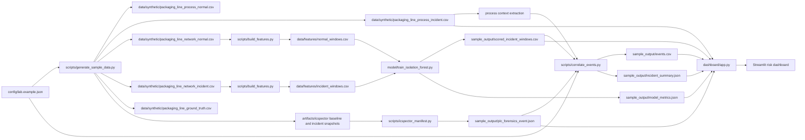

# OT Sentinel Lite architecture

This document explains how OT Sentinel Lite produces an explainable incident assessment from synthetic OT evidence.

## Design goals

- Keep the entire project reproducible without hardware dependencies.
- Correlate model output with deterministic evidence rules.
- Separate network behavior, PLC artifact integrity, and process impact signals.
- Produce human-readable evidence that can be traced to source artifacts.

## Problem context and impact

OT incidents are often investigated in silos: security tooling captures network anomalies, controls tooling tracks PLC changes, and operations teams investigate process quality or downtime separately. When those streams are not correlated quickly, response time and confidence both degrade.

This project models a common high-impact pattern: a subtle controller parameter change that does not immediately trip obvious alarms but later drives measurable process disruption. Even in a synthetic lab, the scenario demonstrates how missed causal linkage can increase downtime, scrap, and troubleshooting cost.

## Why this architecture is useful

- It ties each incident claim to concrete evidence artifacts.
- It avoids opaque risk outputs by using explicit weighted triggers.
- It supports staged adoption, starting with synthetic data and progressing to isolated hardware labs.
- It gives mixed audiences (security, controls, operations) one shared incident narrative.

## System flowchart

## Pipeline stages

1. Synthetic evidence generation
   - Script: `scripts/generate_sample_data.py`
   - Produces normal and incident process telemetry, network sessions, and ground-truth timeline.

2. Feature engineering
   - Script: `scripts/build_features.py`
   - Converts session-level records into fixed 60-second windows per source endpoint.

3. Anomaly modeling
   - Script: `model/train_isolation_forest.py`
   - Trains Isolation Forest on normal windows only, then scores incident windows.

4. PLC artifact integrity
   - Script: `scripts/icspector_manifest.py`
   - Computes deterministic hashes for baseline and incident PLC artifact exports.

5. Evidence correlation
   - Script: `scripts/correlate_events.py`
   - Fuses deterministic triggers and model evidence into explainable event rows and final summary.

6. Visualization
   - Script: `dashboard/app.py`
   - Presents severity, timeline, trigger composition, process effects, and audit evidence.

## Risk logic summary

The final risk score is the capped sum of active weighted evidence categories from `config/lab.example.json`.

- New source endpoint observed
- Scan-like connection behavior
- Model anomaly threshold breach
- IDS alert overlap
- PLC programming activity
- PLC artifact change

The resulting severity is mapped from the score and emitted in `sample_output/incident_summary.json`.

## Output contracts

- `sample_output/events.csv`: normalized event records used for timeline and analysis.
- `sample_output/incident_summary.json`: headline severity, score, evidence flags, and verdict.
- `sample_output/plc_forensics_event.json`: deterministic artifact delta details.
- `sample_output/scored_incident_windows.csv`: per-window anomaly scores and source context.

## Safety boundary

The synthetic workflow performs no active network scanning or controller writes. Raspberry Pi and live controller integration are optional later phases documented in `pi-integration-plan.md`.
