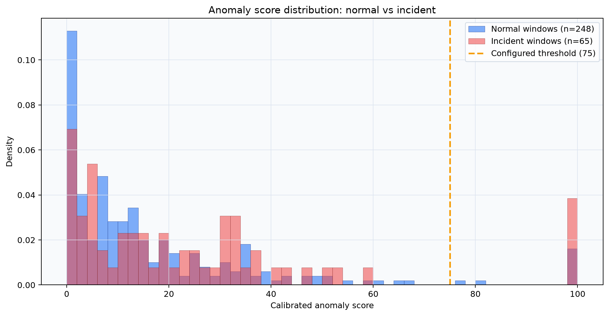
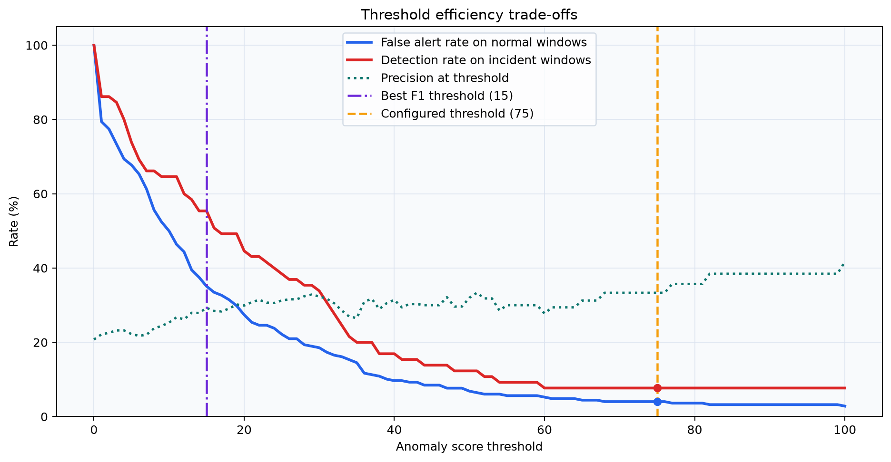
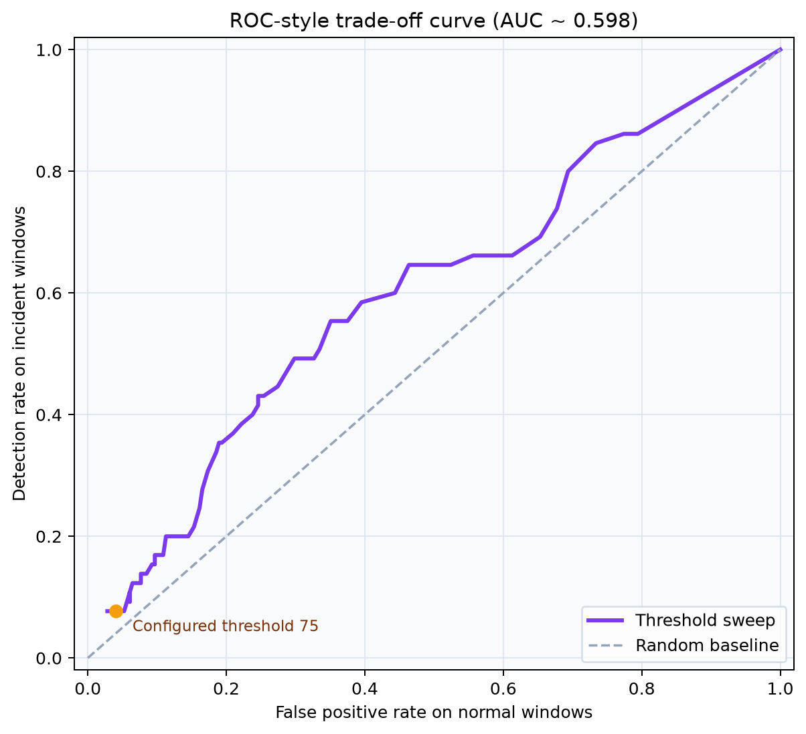

# Model efficiency plots

These static plots summarize how the Isolation Forest score behaves on synthetic normal and incident windows.

## Plot set

### 1) Score distribution



What it shows:
- Separation between normal and incident score populations.
- Position of the configured threshold used by the correlation pipeline.

### 2) Threshold efficiency trade-offs



What it shows:
- False alert rate on normal windows as threshold changes.
- Detection rate on incident windows as threshold changes.
- Precision trend and best-F1 reference threshold.

### 3) ROC-style trade-off curve



What it shows:
- Detection rate versus false positive rate across threshold sweep.
- Relative operating point at the configured threshold.

## Regenerate plots

Run this from the repository root:

```powershell
python scripts/export_model_efficiency_plots.py
```

Generated outputs:
- `docs/plots/model_efficiency_distribution.png`
- `docs/plots/model_efficiency_threshold_curves.png`
- `docs/plots/model_efficiency_roc_proxy.png`
- `docs/plots/model_efficiency_summary.json`
